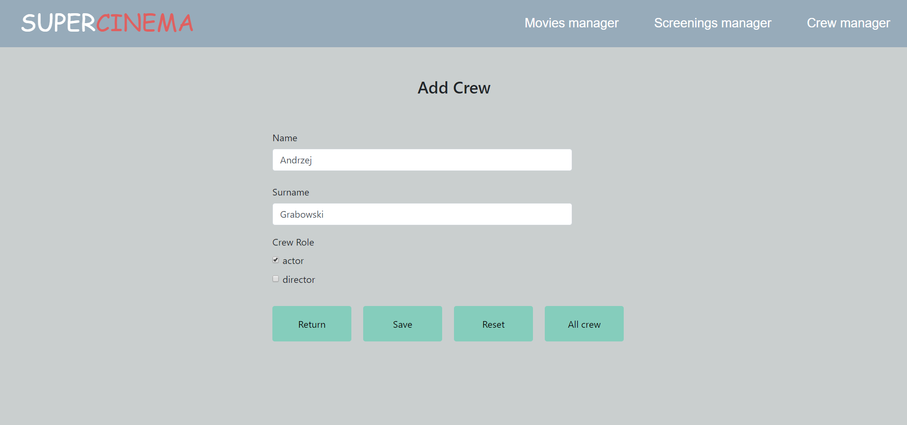
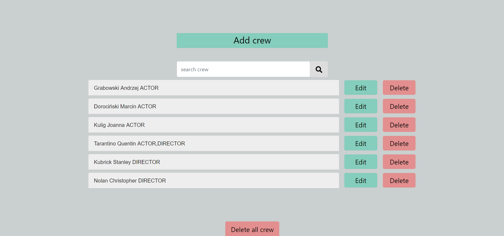
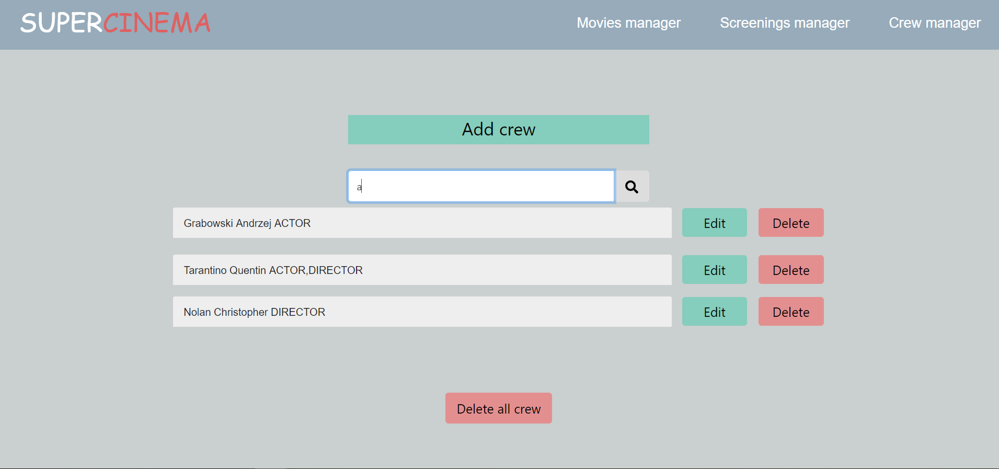
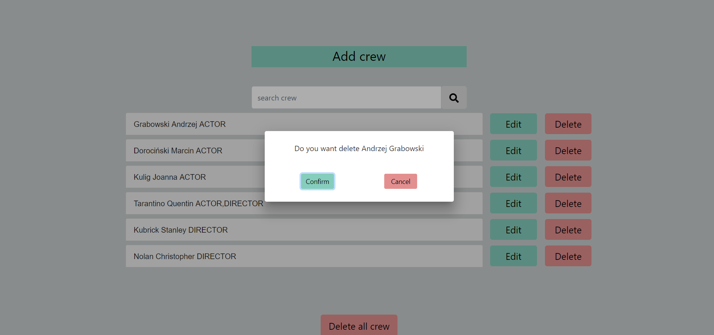
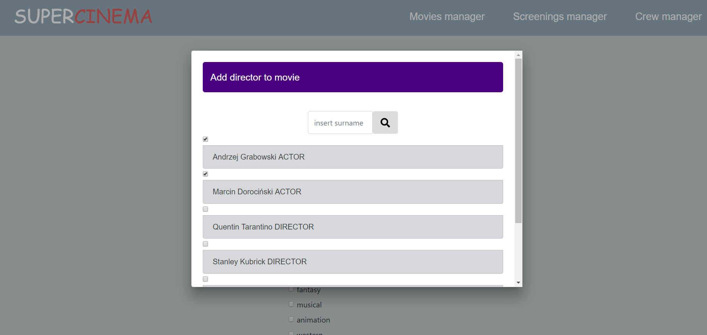
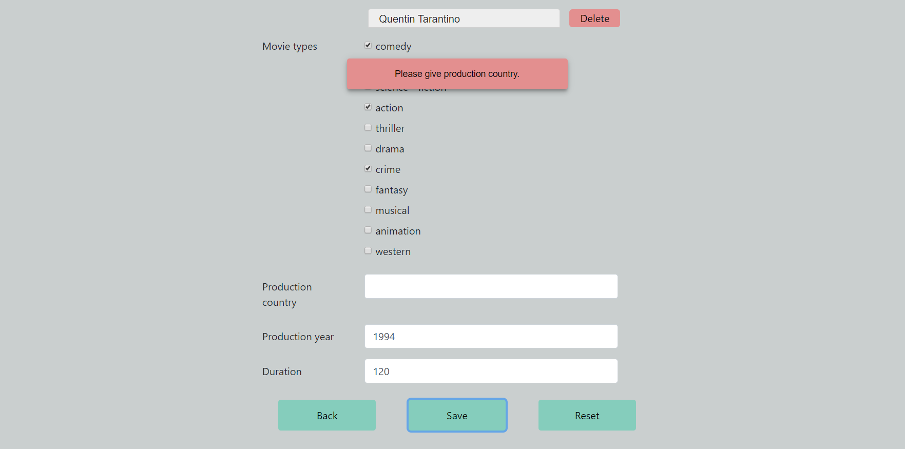
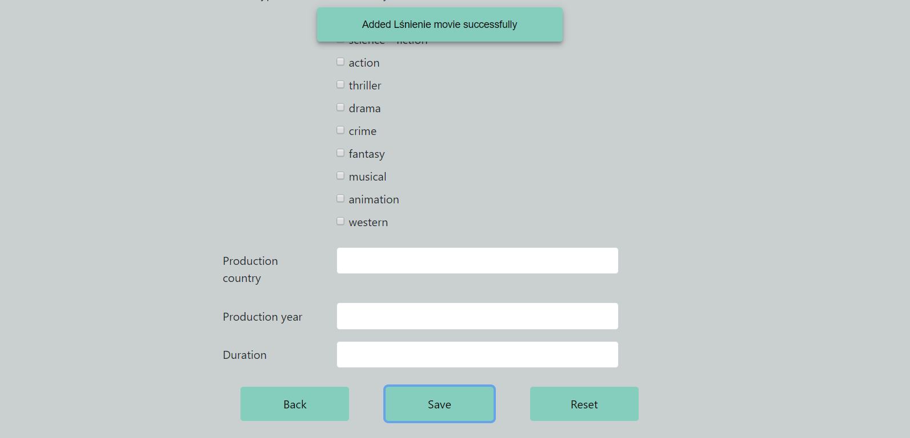
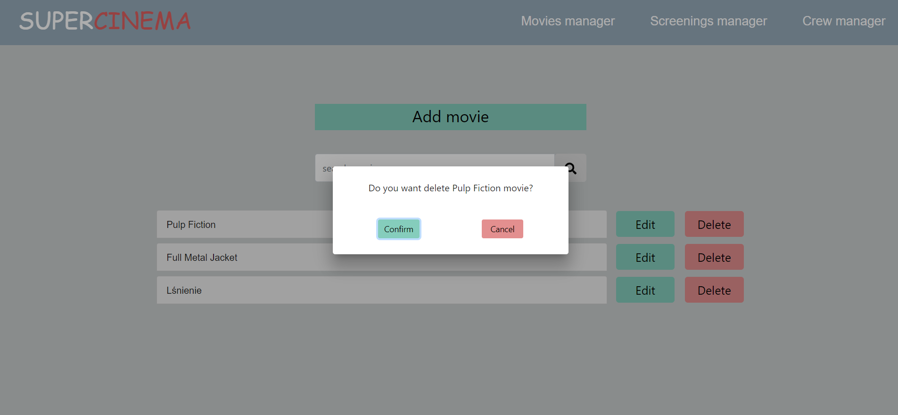
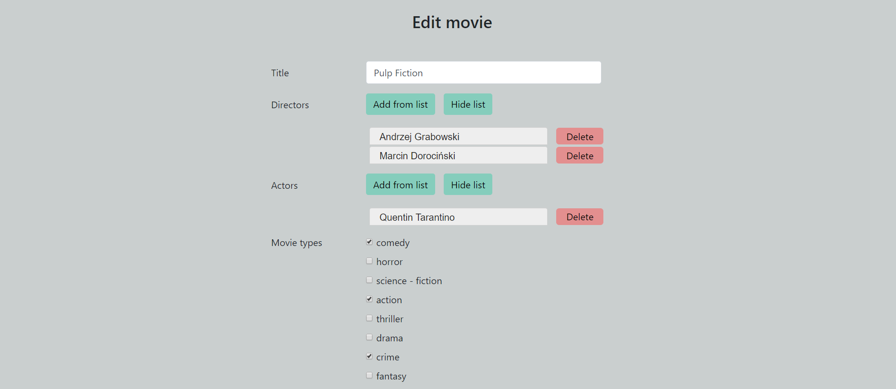

# SuperCinema
REST application for managing movies screenings in cinema. <br/>
Project developed with Gitflow Workflow.

#### Stack
* Backend: Java 8, Spring Boot, Hibernate, REST, MySQL, H2 DB, Mockito, JUnit4, Lombok, Maven 
* Frontend: Angular 7, TypeScript, HTML, Scss
* Tools: Docker, MySql Workbench 

#### Features

- [x] Adding, editing and deleting actors/directors 
- [x] Adding, editing and deleting movies with actors/directors
- [x] Validation of incorrect addition and editing actors/directors or movie
- [x] Notification for correct or incorrect addition/removal actors/directors or movie
- [x] Searching movie by title, searching actors/directors by surname
- [x] H2 database for testing only
- [x] Dockerizing MySql
- [x] Dockerizing backend
- [x] Dockerizing frontend

#### Examples of some features













#### Prerequisites
Application requires running MySQL database on localhost:3306 with an user specified in *\backend\src\main\resources\application-remote.properties*
 
#### Build and run Java application (localhost:8080)

```sh
$ cd backend && mvn clean install
```
```sh
$ java -jar -Dspring.profiles.active=remote target/backend-0.0.1-SNAPSHOT.jar
```

#### Develop Java (localhost:8080) and Angular (localhost:4200):

```sh
$ cd backend && mvn spring-boot:run -Dspring-boot.run.profiles=remote
```
```sh
$ cd ..\frontend && ng serve --open
```

#### Run Java tests:
```sh
$ cd backend && mvn test
```

#### To do

- [ ] User authentication
- [ ] Parsing CSV file with screening rooms configuration (rows and seats number in rooms)
- [ ] Managing display of movies in screening rooms


### Deploy to remote server

1. Inside folder: /backend:
```mvn clean install```
2. Inside folder: /frontend:
```npm run build```
3. Upload to remote server: 
- file: ```docker-compose.yml```
- folder structure with file: ```/backend/target/backend-0.0.1-SNAPSHOT.jar```
- folder with files: ```/frontend/dist```
4. Run from / folder ```docker-compose up```